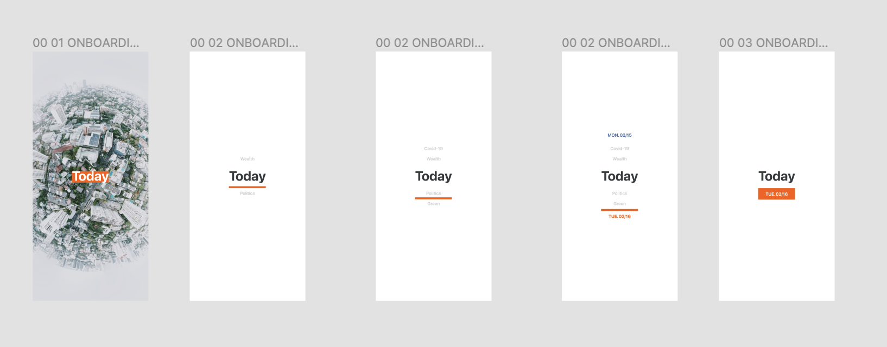
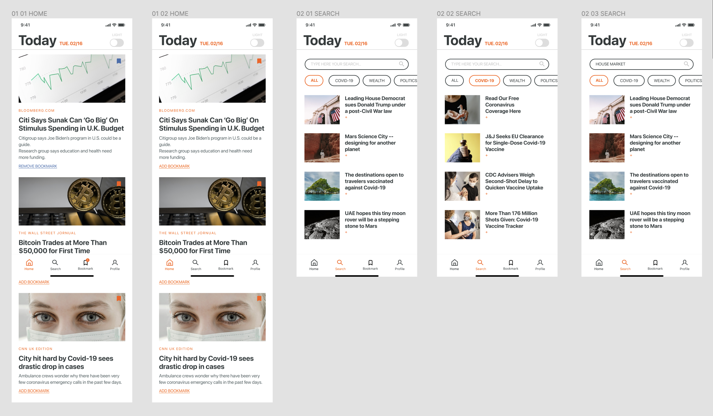
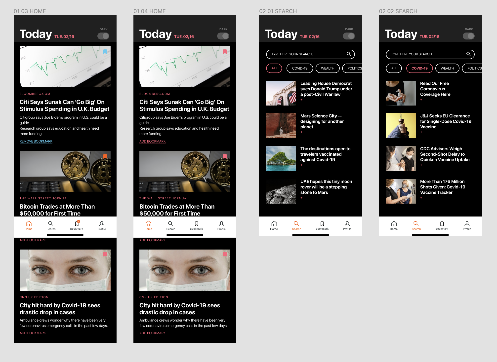
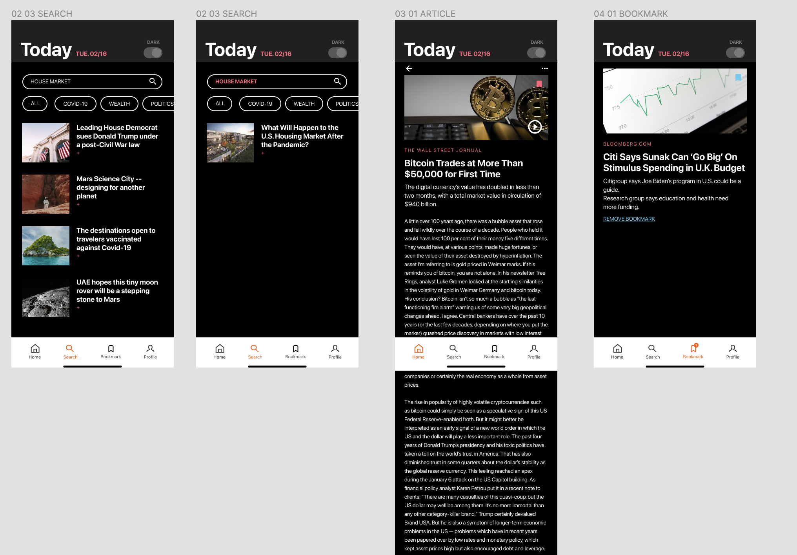

# TODAY News App

Embarking on the Today News App project as a UI designer offered a unique platform to enhance user engagement through visual design and interactivity, particularly focusing on animations and the implementation of a dark mode feature. Today News, aiming to redefine the way users consume news on mobile devices, required a design approach that could cater to readability, user comfort, and a dynamic user interface to bring the latest news to life.

[Figma file](https://www.figma.com/file/NaitANLdhu5SjpXuTMLiOy/TODAY---NEWS-APP?type=design&node-id=0%3A1&mode=design&t=mCF8zZ21ETFmzMKa-1)
[Prototype](https://www.figma.com/proto/NaitANLdhu5SjpXuTMLiOy/TODAY---NEWS-APP?page-id=0%3A1&type=design&node-id=44-2&viewport=948%2C307%2C0.13&t=qXEwsVRNVKXCwzGA-1&scaling=scale-down&starting-point-node-id=7%3A247&show-proto-sidebar=1&mode=design)

### My Role

My role in the Today News App project was to innovate and refine the user interface with a particular emphasis on introducing engaging animations and a user-friendly dark mode. This initiative was driven by the goal to offer a seamless and visually appealing experience for news readers, adapting to their preferences and environmental conditions. Responsibilities included:

- Designing and implementing animations that guide users through the app, making the news reading experience more interactive and engaging.
- Developing a dark mode that not only provides visual comfort in low-light conditions but also extends battery life on OLED and AMOLED screens.
- Working closely with the development team to ensure animations were optimized for performance and would not detract from the app’s responsiveness.

### Design Process

The design process for integrating animations and dark mode into the Today News App encompassed several strategic steps:

1. **User Research and Preferences:** Initial efforts involved researching user preferences for app animations and dark mode, including when and how they preferred to use these features. This step ensured that the design decisions were grounded in user needs and habits.

2. **Animation Design:** Focusing on micro-interactions, such as button clicks, page transitions, and content loading animations, I sketched and prototyped animations that added a layer of engagement without overwhelming users. Tools like Adobe After Effects and Lottie were used to create smooth, lightweight animations that could be easily integrated into the app.

3. **Dark Mode Implementation:** For the dark mode design, I selected a color palette that reduced eye strain in low-light conditions, ensuring text readability and visual comfort. The design process involved creating contrast levels that complied with accessibility standards, ensuring that information hierarchy was maintained across both light and dark themes.

4. **Prototyping and Testing:** With the animations and dark mode designed, interactive prototypes were created using tools like Figma and Adobe XD. These prototypes were then tested for user feedback on the effectiveness and appeal of the animations, as well as the usability of the dark mode feature.

5. **Collaboration with Developers:** Working closely with the app developers was crucial to accurately implement the animations and dark mode. This included providing detailed documentation and working through iterations to refine the features based on technical constraints and performance optimization.

6. **User Testing and Iteration:** After implementation, the app underwent rigorous user testing to gather feedback on the animations and dark mode usability. This feedback informed further iterations, refining the UI to better meet user expectations and enhance their reading experience.

7. **Launch and Continuous Improvement:** Upon the successful integration and user approval of the animations and dark mode, the app was launched. Continuous monitoring and user feedback collection were essential for ongoing improvements and updates to the UI.

Contributing to the Today News App project was an enriching experience that allowed me to explore the dynamic intersection of animation, design, and user preferences. By focusing on creating a visually engaging and comfortable reading environment through animations and dark mode, I aimed to elevate the user experience, making Today News a preferred app for news consumption. This project highlighted the importance of UI design in enhancing app usability and user satisfaction in the digital news landscape.

